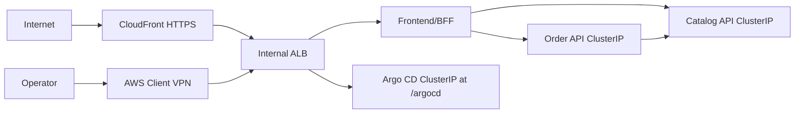

# TechX Chart

Helm and Argo CD configuration for the TechX internship thin slice. The chart
owns exactly three restricted workloads. In the domain/VPN profile, the
frontend and Argo CD share one internal ALB while Catalog and Order remain
private `ClusterIP` services.

## Validate and test

Static checks render the AWS desired state, exercise schema-negative cases,
and assert resource count, exposure, rollout, probe, secret, and security
contracts:

```powershell
./scripts/verify.ps1
```

The local overlay keeps production-like Deployments, Services, probes,
resources, security contexts, Secret references, and NetworkPolicies while
disabling the AWS-specific Ingress. It uses the Phase 4 images already built
as `techx/frontend:local`, `techx/catalog:local`, and `techx/order:local`:

```powershell
./scripts/local-k8s.ps1 -Action Test
./scripts/local-k8s.ps1 -Action Cleanup
```

The test profile uses Minikube with Calico and a dedicated DynamoDB Local
namespace, executes the real business flow, proves order lookup and idempotency
replay after restarting Order API, restarts Catalog, performs Helm
upgrade/rollback, verifies an untrusted pod is denied, and removes both test
namespaces. No ALB is mocked or claimed as locally tested.

## Phase 9 AWS acceptance and GitOps rollback

After a newly reviewed AWS apply and immutable image publish, run the cloud-only
checks in this order. The script never changes Git or pushes an image; those
auditable changes remain explicit operator steps:

```powershell
./scripts/phase9-aws-acceptance.ps1 -Action Baseline -ExposureProfile domainVpn -NetworkView Public -PublicUrl 'https://shop.dinhminhkhoa.id.vn/'
./scripts/phase9-aws-acceptance.ps1 -Action Baseline -ExposureProfile domainVpn -NetworkView Private -PublicUrl 'https://shop.dinhminhkhoa.id.vn/'
./scripts/phase9-aws-acceptance.ps1 -Action Resilience -ExposureProfile domainVpn -PublicUrl 'https://shop.dinhminhkhoa.id.vn/'
./scripts/phase9-aws-acceptance.ps1 -Action SelfHeal

# Push the reviewed values-staging.yaml commit that selects the candidate immutable tag.
./scripts/phase9-aws-acceptance.ps1 -Action WaitRevision -ExpectedRevision '<candidate-chart-sha>' -ExpectedImageTag 'staging-<candidate-sha>'

# git revert <candidate-chart-sha>, review the diff, and push the revert.
./scripts/phase9-aws-acceptance.ps1 -Action WaitRevision -ExpectedRevision '<revert-chart-sha>' -ExpectedImageTag 'staging-<baseline-sha>'
```

The public `Baseline` proves CloudFront HTTPS, VPC origin use, public
`/argocd` denial, one active Client VPN association, the shared internal ALB,
restricted Pod Security/runtime contexts, the exact three Deployments, private
backend Services, request-ID correlation, and the frontend ServiceAccount's
lack of Kubernetes API permissions. Run the private baseline only after the AWS
VPN client is connected; it proves split-view DNS and the Argo CD subpath on the
same hostname. `Resilience` covers double-submit, rate limiting,
request-ID logs, the workload allow/deny matrix, a bounded Catalog outage and
recovery, and DynamoDB-backed Order persistence after a pod restart. `SelfHeal` creates
controlled replica drift and waits for convergence. `WaitRevision` ties candidate
and revert evidence to an exact Git revision, immutable ECR tag/digest, completed
zero-critical scan, and runtime image IDs. Run this only while the approved staging
environment exists; every new apply still requires fresh owner confirmation.

The repository verifier also runs `scripts/evidence-audit.ps1`, which rejects
tracked state/key artifacts and common credential patterns and requires every
Phase 7–9, teardown, and limitation evidence section to remain present.

## GitOps ownership

`gitops/clusters/staging/application.yaml` is the only workload bootstrap object
applied manually on AWS. Argo CD reads `values-staging.yaml` and
`values-domain-vpn.yaml`, creates the
restricted namespace, then owns sync, prune, self-heal, and rollback-by-revert.
The Secret is always bootstrapped outside Git. Catalog, Order, and Argo CD stay
private; normal Argo CD access is available only through AWS Client VPN at
`/argocd/`. No observability stack or public administrative UI is included.

## Shared deployment contract

This table is the handoff contract copied verbatim across `techx-platform`,
`techx-chart`, and `techx-infra`. Contract changes must update all three
copies, every affected consumer, and the corresponding tests in one coordinated
change.

| Contract item        | Locked value                                                                                                                                                                                                                        |
| -------------------- | ----------------------------------------------------------------------------------------------------------------------------------------------------------------------------------------------------------------------------------- |
| AWS region           | `us-east-1`                                                                                                                                                                                                                         |
| Kubernetes namespace | `techx-staging`                                                                                                                                                                                                                     |
| Services / ports     | `frontend:3000`, `catalog-api:3001`, `order-api:3002`                                                                                                                                                                               |
| Cluster DNS          | `frontend.techx-staging.svc.cluster.local:3000`, `catalog-api.techx-staging.svc.cluster.local:3001`, `order-api.techx-staging.svc.cluster.local:3002`                                                                               |
| Secret / key         | Secret `techx-staging-secrets`, data key `order-api-key`; injected as `ORDER_API_KEY` only into frontend and Order                                                                                                                  |
| Runtime environment  | Frontend: `CATALOG_API_URL`, `ORDER_API_URL`, `ORDER_API_KEY`; Catalog: `CATALOG_PORT`; Order: `ORDER_PORT`, `CATALOG_API_URL`, `ORDER_API_KEY`, `ORDER_TABLE_NAME`, `AWS_REGION`, `ORDER_STORE_TTL_MS`, `ORDER_IDEMPOTENCY_TTL_MS` |
| Health / readiness   | Every service exposes unauthenticated `GET /healthz` and `GET /readyz`                                                                                                                                                              |
| Order store          | DynamoDB single-table persistence; orders retained 30 days, idempotency records 24 hours; TTL is enforced by the application and DynamoDB cleanup                                                                                   |
| Pricing              | Catalog price snapshot; shipping `999` cents below subtotal `5000`, otherwise free; `totalCents = subtotalCents + shippingCents`                                                                                                    |
| Images               | `058114477594.dkr.ecr.us-east-1.amazonaws.com/techx/frontend:staging-{short-sha}`, `.../techx/catalog:staging-{short-sha}`, `.../techx/order:staging-{short-sha}`                                                                   |
| Exposure             | CloudFront is the only public entry point and reaches one internal ALB through a VPC origin; Catalog, Order, and Argo CD remain `ClusterIP` services                                                                                |
| Public URL           | `https://shop.dinhminhkhoa.id.vn/`; public `/argocd` and `/argocd/*` return `403`                                                                                                                                                   |
| Private operator URL | The same hostname resolves to the internal ALB over AWS Client VPN; Argo CD is available only at `https://shop.dinhminhkhoa.id.vn/argocd/`                                                                                          |
| DNS and TLS          | Cloudflare owns public DNS, Route 53 provides the private split-view record, and one issued ACM certificate covers the storefront hostname                                                                                          |
| Network boundary     | One internal ALB serves frontend and Argo CD; only CloudFront may use HTTP `80`, only the Client VPN association security group may use HTTPS `443`                                                                                 |



Licensed under Apache-2.0. See [LICENSE](LICENSE).

Bootstrap verification:

```powershell
./scripts/verify.ps1
```
